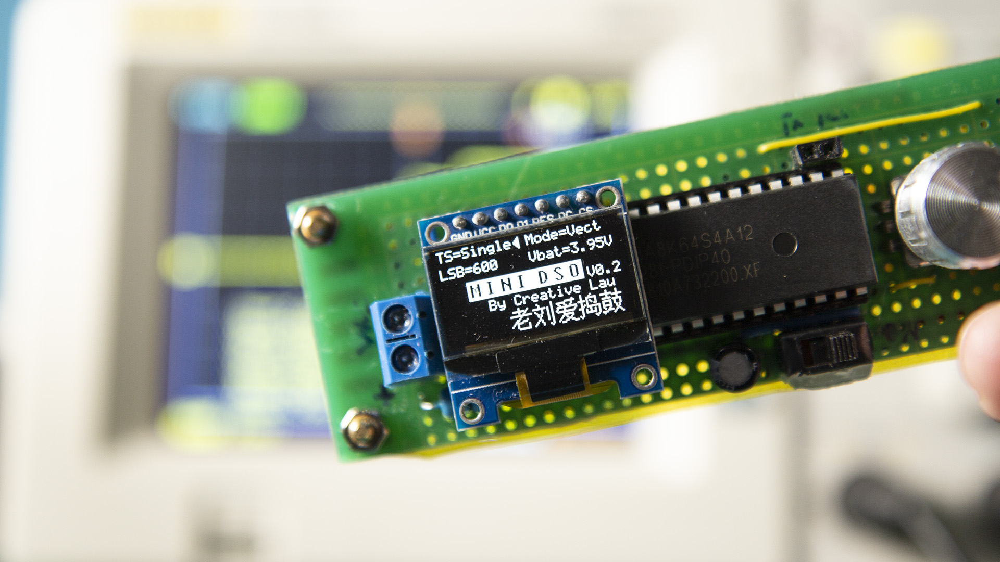

# Mini-DSO
This is a simple oscilloscope made with STC MCU. 

You can use this Mini DSO to observe waveform.

Time Interval: 100us-500ms

Voltage Range: 0-30V

Draw Mode: Vector or Dots

Material list:

STC8A8K64S4A12 MCU x 1 

SSD1306 OLED(SPI) x 1

Resistor: 

1W 10k x 1 

1/4W 2k x 2 

1/4W 10k x 1

Capacitor: 

47uF x 1 

0.01uF x 1

EC11 Encoder x 1 

Tact Switch x 1 

2-Pin Terminal x 1

Socket Strip: 

7-Pin x 1 

2-Pin x 1

Li-ion Battery 

5V Booster Module

Bilibili Video Tutorial: https://www.bilibili.com/video/BV1ai4y1t79R

YouTube Video Tutorial: https://youtu.be/c6gBv6Jcz7w

2020-04-29

Version 0.2

Add Normal Sweep and Single Sweep Function. This is a very useful function to observing the waveform mutation.

